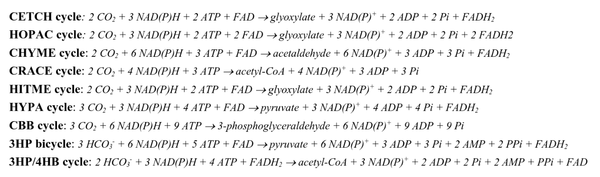

MOCK

P1
1. Fatty acid synthesis and fatty acid oxidation (betaoxidation) are not simple reversals of each other. compare and contrast the features of the pathways of betaoxidation and fatty acid synthesis

- Fatty acid synth
    - step 1: acetyl group is exported from the mitochondrion
        - There are no transporters for NADH, AcoA or oxaloacetate
            - There are: Phosphate (driven by $\Delta$pH), Pyruvate ($\Delta$pH) Adenine nucleotide ($\Delta \psi$), Glutamate/aspartate ($\Delta \mu _H ^+$), Dicarboxylate (electroneutral), Tricarboxylate (electroneutral) $\alpha$ - Ketoglutarate (electroneutral) and Oxaloacetate (electroneutral)
        - oxaloacetate forms citrate by adding acetyl group
            - Mitochondrial citrate carrier: generates NADPH for lipid/chlstrl biosynth   bb
        - AcoA carboxylase
            - Large ER tertiary protein enzyme synthesize Malonyl CoA from Acetyl CoA (carboxylation) consuming 1ATP
            - genes ACC1 and ACC2 regulated by alternative splicing in response to nutritional status
            - allosteric motifs for activation by citrate and inhibition by fatty acids

小徐pre

第三世界抵抗与国际组织扩张

反传统functionalism
国际组织的扩张与成型有第三世界参与
“第三世界”是由社会运动定义的
国际组织愈发将制度化法律适应于？
首先发达国家成立的国际组织并未考虑第三世界

印度抗议
印度国内以及国际运动反对世界银行可能破坏环境的援助计划，并撬动世界银行的政策方向
T2.
Q1. The greatest calibrated uncertainty is observed at core position 310
Q2. The smallest calibrated uncertainty is observed at core position 90
Q3. Samples 315 and 313
Q4. Superficial Peat - 127cm, clay - 183cm, sand - 5cm, Basal Peat - 35cm
Q5. Basal Peat - 926, 733, 582, Clay - 1078, 738, 387, Silty Peat - 751, 853, 755
T3.Basal Peat - 0.477, large time gap between top and bottom of clay (800yrs); Clay - 2.480; Top Peat - 1.490, significantly faster deposition than basal peat

There is a continuous accumulation of sediment at this site at inconsisntant rate, such differenctiating rates can be ascribed to transition between marine and terrestrial deposition environments. Marine deposition rates are higher due to increased terrigenous sediment transport in the North Atlantic compared to terrestrial decomposition. This may also apply to the two stages of peat accumulation. An erosion surface is positioned at 315cm in the core, corresponding to a ~800 years gap between cal BP estimated at top of basal peat and bottom of silty clay. It may be worth noting that foraminefera was calibrated using the marine20 dataset, which produces the least time discrepancy between the top layer of clay and bottom layer of superficial peat. Coarse sand containing the shell fragment was transported from another benthic source that was deposited before the surface of basal peat it covered in this core.

The following chronology can be constructed: a terrestrial deposition enviroment predominated the site producing this sedimentary archive, there is then a potential rise in relative sea level following an abrupt high-energy transportation event, submerging the site to form shallow marine environemts, high sedimentation rate in this environment eventually lead to emergence of the site and a restoration of terrestrial environment. The discussion proposes hypothesis to two conditions outlining the above chronology: one for the cause of submergance, one for the cause of reemergance.

Hypothesis that submergance was by relative sea level rose due to meltwater pulse is nonsensual. Since 1. the estimated time at which the abrupt transportation event took place does not align with record of meltwater pulses in the North Atlantic; 2. it is unreasonable that a meltwater event would transport benthic sediment to the shore. Assuming uniform deposition rate and disregarding compaction, ~40cm of basal peat was removed by the abrupt transportation event. The abruptness and high energy profile of this event aligns it close to a tsunami. Therefore, is it likely that relative sea level change here is caused primarily by vertical land motion due to subsidence of  tectonic plate? Again this is unlikely, since Newfoundland is not located near subduction plate boundaries. It is likely, however, that glaciastatic adjustment operates in this rise in relative sea level, since Newfoundland is located in the periphery of the area of decompression caused by the North American ice sheet and is experiencing rising relative sea level as a result of glacioisostatic adjustment. Submergance can therefore be explained by glacioisostatic adjustment in conjunction to surface erosion by a tsunami-like event. What about reemergance? Since there is a transition from marine to intertidal to terrestrial characteristics in the sedimentary archive, it is feasible to hypothesize that it is sedimentation that lead to reemergance, this also aligns with the high sedimentation rate seen for the clay section of the core. It then begs the question why this high rate of deposition? considering increased rates of deposition in reemerged peat than basal peat, it may be suggested that a new source of sediments or new sediment transportation had been introduced by the time of reemergance. The discussion hypothesize it to be a change in inland hydrography that lead to alluvial feeding of sedimentary material to the site, which may also account for the high rate of deposition in the submerged section of this chronology.

Therefore the chronology can be formulated as such: a tsunami-like event took place approximately 1600 calendar years BP, eroding and submerging parts of the coastline. Inland hydrographical changes then lead to high deposition of sediments at this eroded section of the coastline before it reemerged approximately 850 calendar years BP. After emergance, alluvial sediments continue to deposit on the emerged saltmarsh, leading to higher rates of deposition to the present day.

Google Gemini 2.5flash on Oct 31 2025 was prompted with "summarize in 250 words [content of above discussion]" and outputted as such: 

The site shows inconsistent sediment accumulation rates linked to transitions between marine and terrestrial depositional environments. Higher rates occurred during marine phases, likely due to increased terrigenous sediment transport. A significant erosion surface at 315cm represents an ∼800-year gap (cal BP) between the basal peat and the overlying silty clay. Foraminifera and a shell fragment in coarse sand was calibrated on the Marine20 dataset. A deviation of the principle of superposition by the broken shell sample suggests the transport of older benthic material.

The constructed chronology starts with a terrestrial environment, followed by an abrupt, high-energy transportation event that caused submergence and the formation of a shallow marine environment. High sedimentation then led to re-emergence and a return to terrestrial conditions.

The hypothesis that a meltwater pulse caused submergence is dismissed due to timing and the unlikelihood of a meltwater event transporting benthic sediment. The abruptness and high-energy profile of the event aligns it with a tsunami, which is estimated to have occurred around 1600 cal BP, eroding ∼40cm of basal peat. The primary cause of relative sea level rise and submergence is attributed to glacioisostatic adjustment, as Newfoundland is in the periphery of the North American ice sheet's decompression area.

Re-emergence, completed by ∼850 cal BP, is hypothesized to be due to high sedimentation rates in the marine phase. This high deposition is further hypothesized to result from a change in inland hydrography, which introduced a new alluvial sediment source to the site. This new source may also account for the continued higher rate of deposition in the post-emergence peat to the present day.

Soil is a collodial suspension of 

Since we are effectively utilising the plant cell's metabolic processess as a reactor to produce end products for our needs, it is straightforward to imagine the possibility to engineer and manipulate existing pathways or to create new, more effecient pathways by kinetic modelling

Toolkits and archives in synthetic and computational biology had enabled design of specific pathways with kinetics in mind

The CETCH cycle - engineering and assembling existing catalytic agents into novel pathways

Early research focused on searching for and phylogenically analysing carboxylase lineages (e.g. Thaumarchaeota). 

enoyl-CoA carboxylases/reductases (ECRs)selected: relative to other carboxylases, including RuBisCO, ECRs span a broad substrate spectrum (25), are oxygen-insensitive, do not accept molecular oxygen as substrate, require only the ubiquitous redox cofactor NADPH (reduced nicotinamide adenine dinucleotide phosphate), and catalyze the fixation of CO2 with high catalytic efficiency (i.e., on average better than RuBisCO by a factor of 2 to 4) 

Thermodynamically predicted the energy effeciency of proposed metabolic pathways

Experimentally identified bottleneck reactions

Directed evolution of responsible enzymes

Difficulty in the cellular environment - interference with cellular metabolic control

Solution - increase enzyme specificity, spacially confine reactions

Starch synthesis out of the blue: ASAP pathway

    

